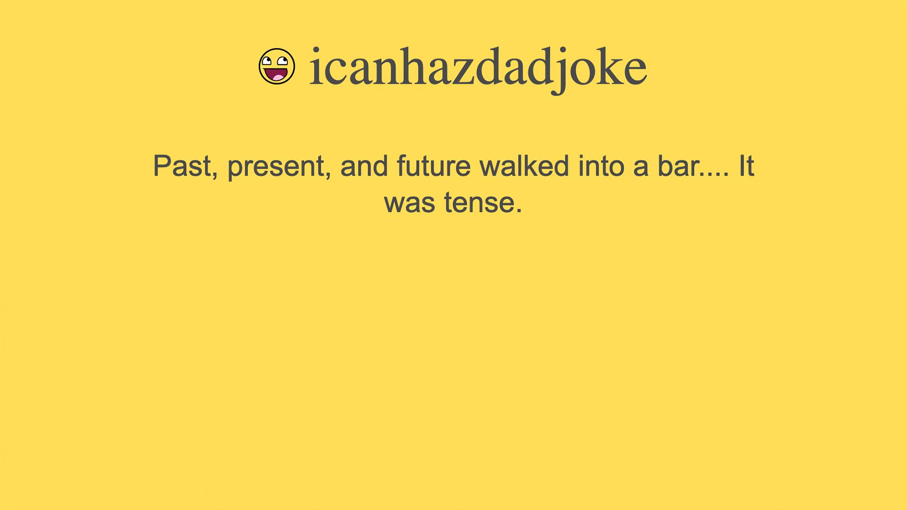

## Dad Joke App Example

This App is a JavaScript/HTML App that retrieves a Dad Joke from
[icanhazdadjoke](https://icanhazdadjoke.com/) every 20 seconds and displays it on the page.

### How to Use

- Clone this repository
- Go to this folder.
- Run `yarn` the first time.
- Run `yarn start` to develop locally. Your app will start on
  [http://localhost:1234/](http://localhost:1234/).
